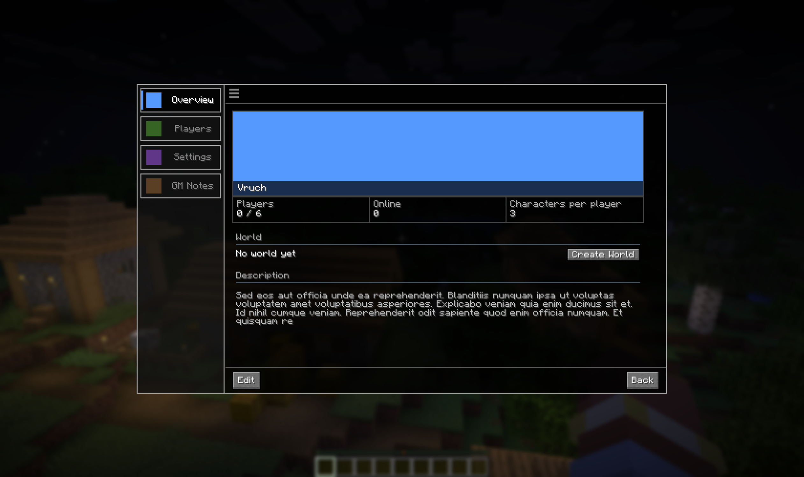
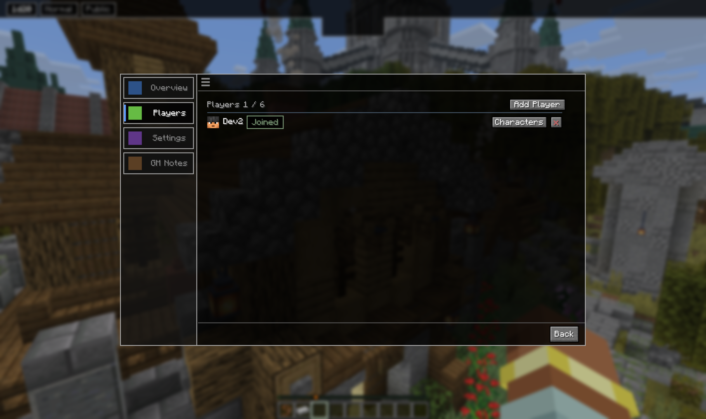
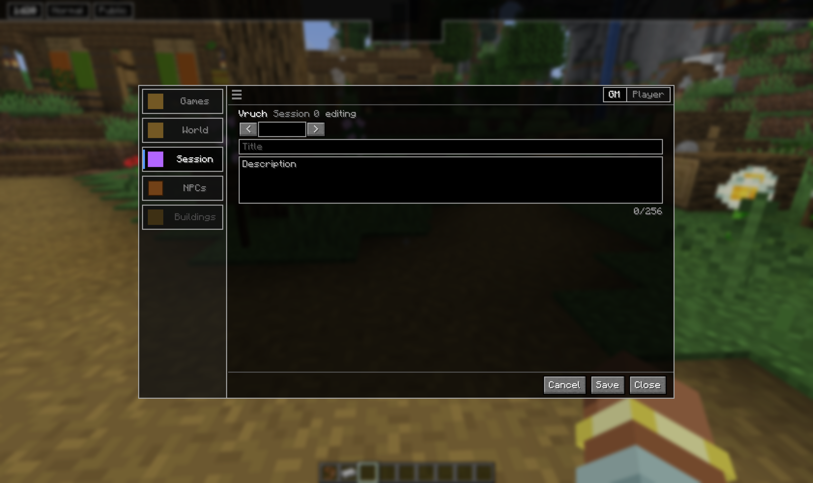
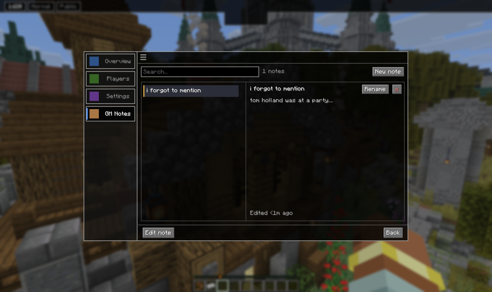
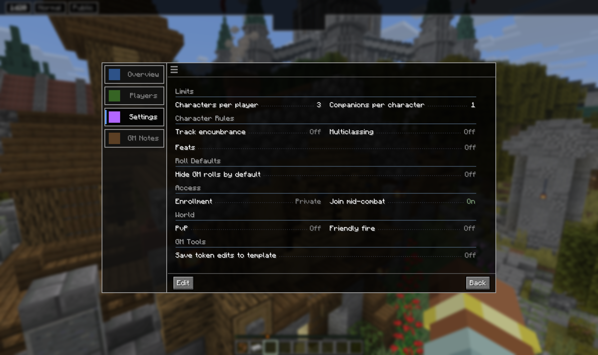

# Campaigns and sessions

A **campaign** is the long-lived thing: a name, a roster, settings, notes and up to three
worlds. A **session** is one sitting inside it.

Campaigns are stored on the GM's own machine, so they travel between servers.
The roster travels with them, which is why a player can be on your roster without having
joined on the server you are currently playing on.

## Opening a campaign

Campaigns tab, click a campaign. It opens on its own screen with four sections: **Overview**,
**Players**, **Settings** and **GM Notes**. **Back** returns to the list.

Overview carries the name, description, cover image and the dates it was created and last
played.

## Players

**Add Player** sends an invite. Each row then shows their name and a state badge:

| Badge | Meaning |
|---|---|
| **Offline** | Not connected right now |
| **Online** | Connected, but you do not have a campaign running |
| **Online, not joined here** | Your campaign is running, they are connected, and they have not accepted on this server |
| **Joined** | Accepted on this server |

These track the **campaign**, not the session. **Joined** means a player has accepted here
and is ready, it does not mean they are in a session.

Because the roster is yours and follows you
between servers, being on it is not the same as having accepted on the server you are
playing on now. A player who joined last week elsewhere shows as **Online, not joined
here** until they accept again.

That row gets an **Invite** button. Sending the invite is how you
bring them back in. It works as soon as the campaign is running, so you can get everyone
accepted before starting the session.

Two more controls appear conditionally:

- **Characters** opens the sheets that player has active in this campaign. It only shows when
  they have some.
- **x** removes them from the roster entirely.

## Sessions

A session is one sitting. It has a number, a title and a description, all editable, and
starting one is what lets players join.

Stopping a session disconnects everyone in it.

You can only have one campaign running at a time.

## If the GM disconnects

The campaign is held open for **30 minutes**. Players get a notice with a countdown, and
the session HUD shows how long is left. Come back inside that window and the session
resumes where it was.

Past 30 minutes the run is purged and everyone is dropped.

## GM Notes

Notes are private to you. Each is a titled entry.

## Settings

Settings are grouped into Limits, Character Rules, Roll Defaults, Access, World and GM
Tools.

**This section is unfinished.** The following settings currently do anything:

- **Characters per player**, a cap enforced when a player brings a character into the campaign
- **Companions per character**, the same for companions
- **Save token edits to template**, which decides whether editing a spawned token writes
  back to the template it came from

The rest are editable and saved, but they are not working yet.

Full syntax for the session commands: [Command reference](../commands/#campaigns-and-sessions)

[Back to the manual index](../)
