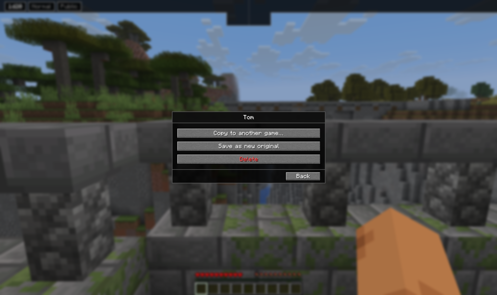
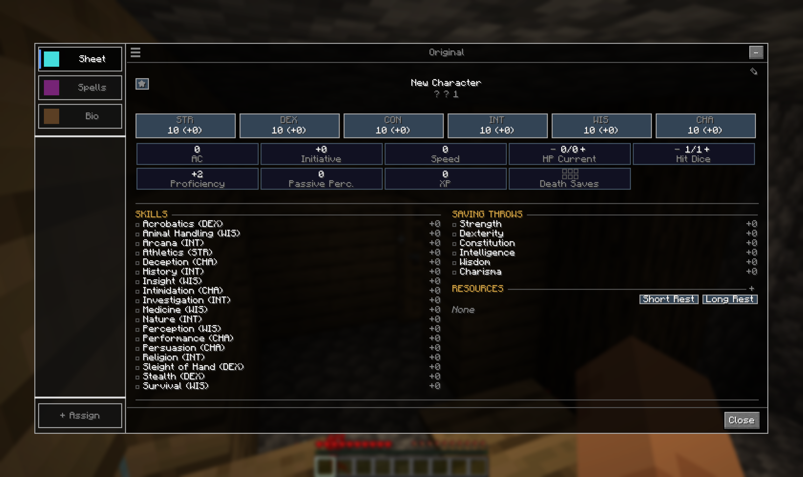
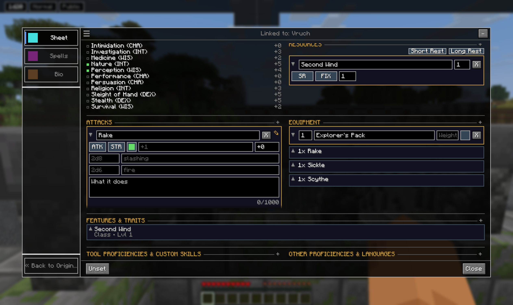
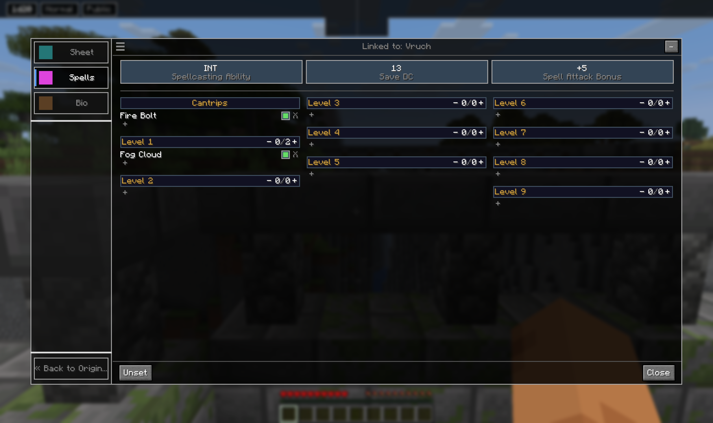
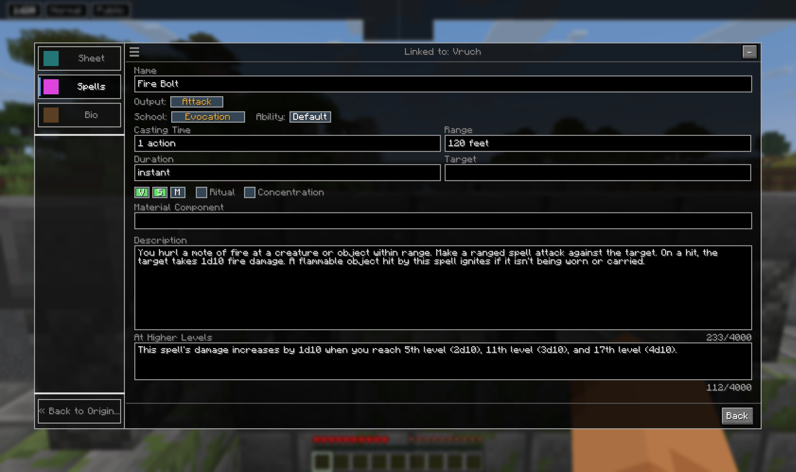
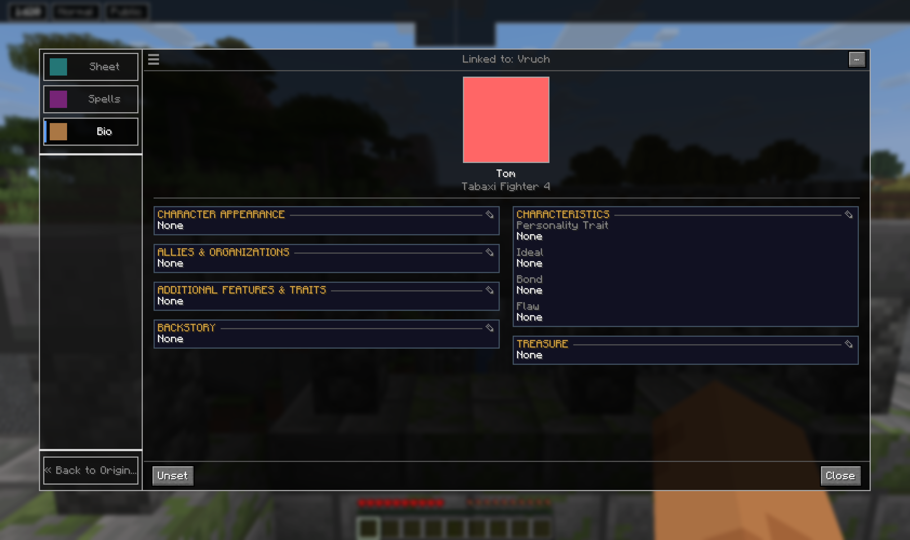
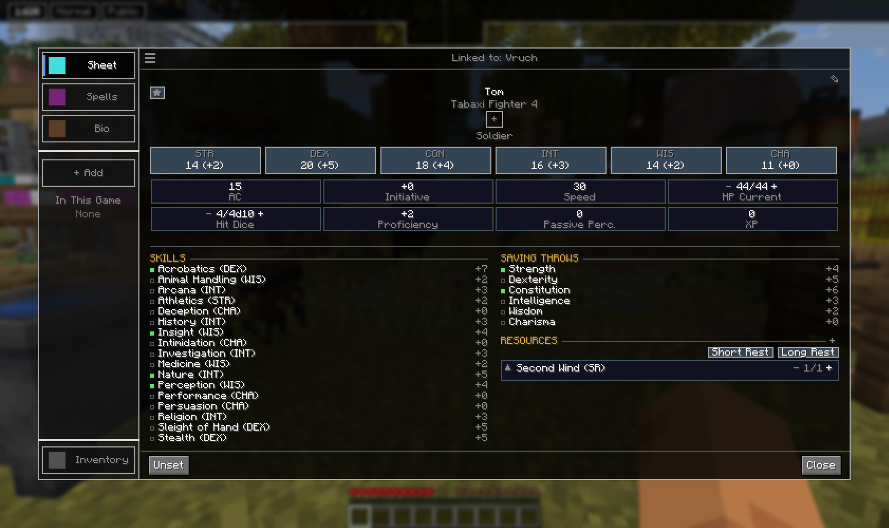

# Characters

A character is a sheet you own and keep on your own machine. It follows you
between worlds and servers, and one character can play in several campaigns at once
without the campaigns interfering with each other.

## Templates and per-game copies

The character you build in the Character tab is a **template**. It is never played
directly. When you assign it to a game you get a **copy** bound to that game, and that copy
is what you play.

The copy is made once and then goes its own way. Levelling it, spending its HP or editing
its equipment never touches the template, and editing the template afterwards never reaches
copies already made. That is deliberate: the same character can join two campaigns and
diverge in each.

A template shows **+ Assign** in the bottom left. A copy shows **Activate**, and its header
names the campaign it is linked to.

The **...** button in the top right opens what you can do with the sheet you are looking at.

**Copy to another game** makes a second copy for a different campaign. **Save as new
original** turns the sheet you are on back into a template, which is how a character who
grew during play becomes the starting point for the next one. **Delete** removes only the
sheet you are on, not the others made from it.

## Building a character

Character tab, **New Character**. You get a blank sheet with everything at 10.

The pencil in the top right opens editing. The star in the top left is **inspiration**.

The **Sheet** tab holds:

- **The six ability scores**, with modifiers derived from them
- **AC, Initiative, Speed, HP, Hit Dice, Proficiency, Passive Perception** and **XP**.
  HP takes the `-` and `+` steps, or click into it and type a change like `+5` or `-10`.
- **Death saves**, which only appear once HP reaches 0
- **Skills** and **Saving Throws**, each with a proficiency marker you toggle
- **Attacks**, **Equipment**, **Features & Traits**, **Resources**, **Tool Proficiencies**
  and **Other Proficiencies**, each a list of rows you add and expand to edit
- **Currency**
- **Short Rest** and **Long Rest**

Rows open in place to edit and collapse back to a summary line.

## Spells

The **Spells** tab carries spellcasting ability, save DC and spell attack bonus at the top,
then cantrips and levels 1 to 9.

Each level has its own slot counter, so you spend and recover slots on the level itself.
The marker beside a spell toggles it between prepared and known, and `+` under a level adds
a spell to it.

Opening a spell gives you name, school, casting time, range, target, duration, material
component and description.

## Bio

The **Bio** tab is the prose half: appearance, the four personality traits, backstory,
allies and organizations, additional features, and treasure.

Each is its own card with its own pencil, so you edit one without opening the rest.

## The active sheet

Assigning a character to a game is not enough, you also need to activate it. By activating it, it
becomes what your inventory key opens, and by activating you can become a player in a game roll and have a token, without having any active character you are just a spectator.

Things appear that were not there before:

- **Unset** replaces Activate in the footer.
- **Inventory** appears at the bottom of the sidebar. It is not part of the sheet, it opens
  your ordinary Minecraft inventory, since the sheet has taken the key it used to use.
- **+ Add** in the sidebar activates another character. It only offers characters already
  assigned to this game, it does not assign new ones.
- **In This Game** appears under it, listing your other active characters in this campaign.
  Clicking one switches the sheet to it.
- The small **+** under the character's name bonds a companion, and likewise only offers
  companions already in this game.

**Unset** makes the character inactive again and hands the inventory key back to Minecraft.
If it was your last active character, you go back to spectating.

## Rolling from the sheet

Rolling works from an active sheet, and only from an active sheet. Most of it is clickable:

- An **ability score** or a **skill** rolls a check
- A **saving throw** rolls a save
- An **attack** rolls to hit, and its damage separately
- A **tool proficiency** rolls a tool check

Modifiers come from the sheet the server holds, not from the number drawn on your screen,
so a locally edited sheet cannot roll better than it should.

## Companions on this sheet

A companion is bonded to a character, so any companions bonded to this one show as chips on
its sheet. Clicking a chip opens that companion.

Building companions, bonding them and playing them is covered in [Companions](../companions/).

## Several sheets at once

Activating is a set, not a switch. A character and a companion can both be active, and the
inventory key opens whichever you had open last. Assigning to a second game does not
deactivate the first.

Full syntax for the assign commands: [Command reference](../commands/#characters-and-companions)

[Back to the manual index](../)
