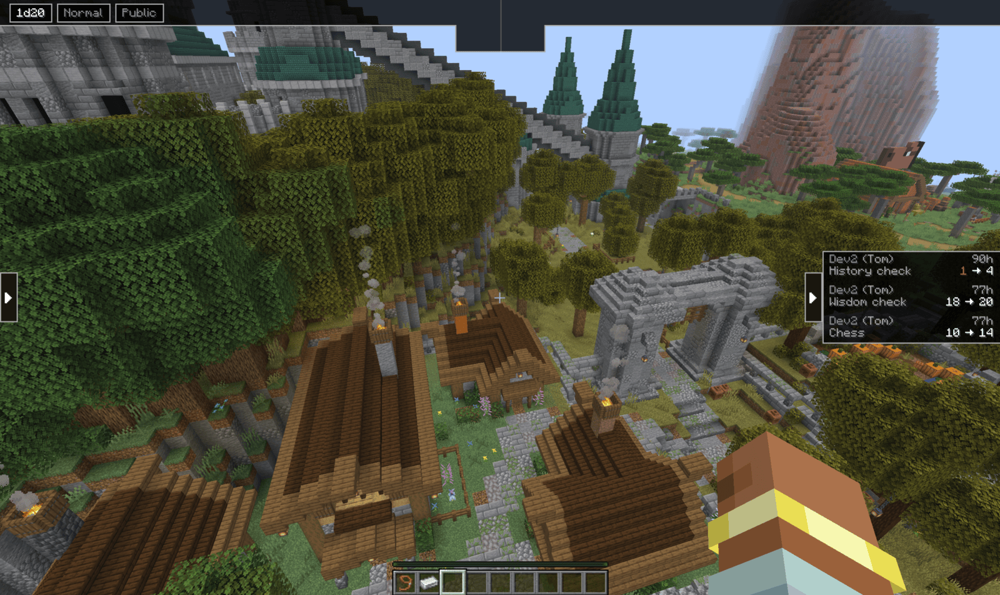
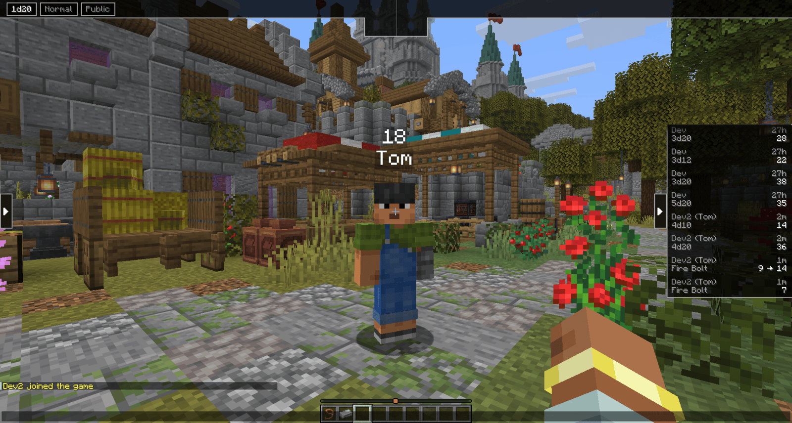
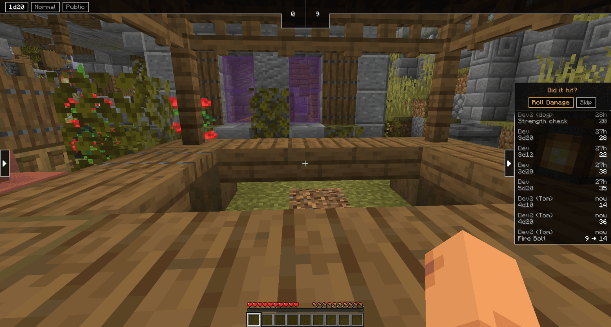
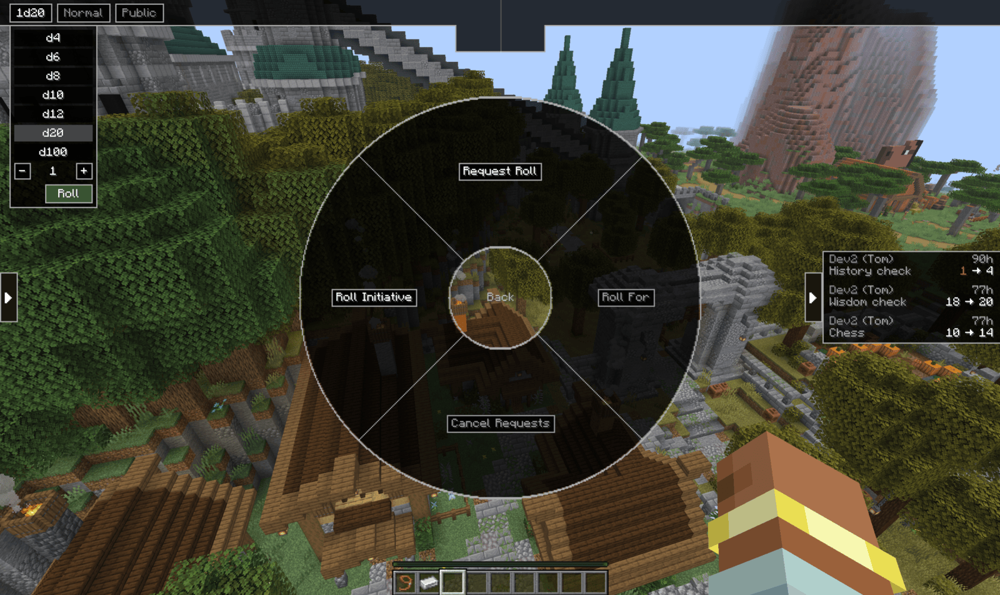
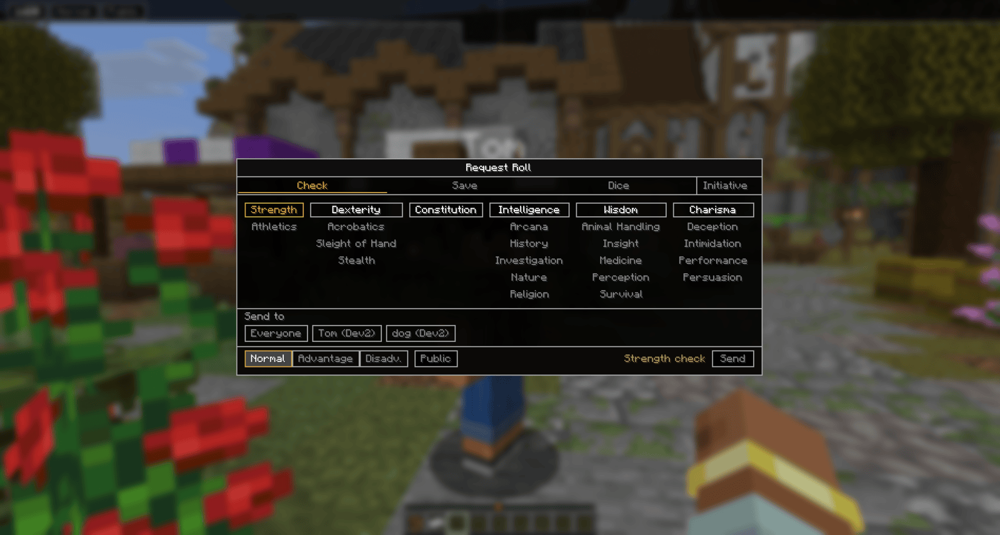
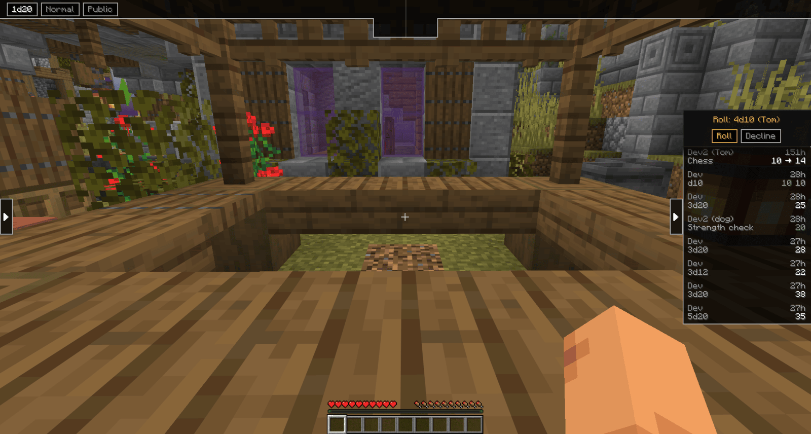
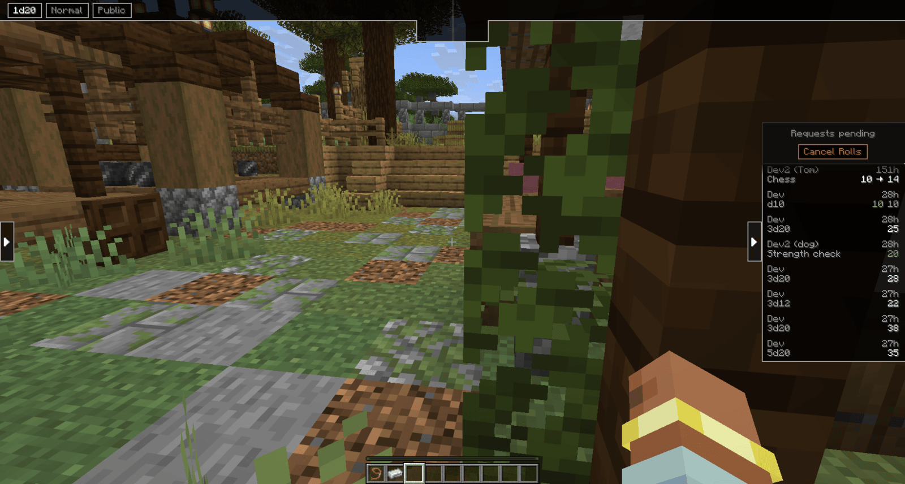

# Dice and rolling

Every roll is made by the server. Your client asks for a roll, the server rolls it and
tells everyone the result, so nobody has to trust anyone else's dice. Modifiers come from
the sheet the server holds, not the number drawn on your screen.

Rolling needs an active character, and the HUD only appears inside the campaign world.

## The HUD

Two pieces, and both collapse with the arrows at their edge.

**Top left, the picker chips.** The die, the mode, and who sees the result. Click a chip to
change it.

- **Mode**: Normal, Advantage or Disadvantage
- **Visibility**: Public or GM Only

**Right, the roll history.** Every roll at the table, newest at the bottom, with who rolled
it and when. A roll made by a character or companion shows that name in brackets after the
player's, so `Dev2 (Tom)` is Dev2 rolling as Tom.

## Rolling

Three ways, depending on what you want.

**From the sheet.** Click a skill, a saving throw, an ability, an attack or a tool
proficiency. The modifier is applied for you. This is the normal way to roll in play.

**From the HUD picker.** Set the die, mode and visibility on the chips, then press **Roll**.
This is the way to make a flat roll that is not attached to anything on your sheet.

**Because the GM asked.** See below.

Results also appear above the roller in the world, so the table sees a roll land without
watching the panel.

## Attacks and damage

An attack rolls to hit first. The result lands, then the panel asks **Did it hit?**

**Roll Damage** rolls the attack's damage as a second entry, and the history shows both
joined, as in `Fire Bolt 9 → 14`. **Skip** drops it, for when the attack missed.

The GM decides whether it hit. The mod does not compare your roll against a target's AC.

## GM-only rolls

Set the visibility chip to **GM Only** before rolling and the result stays between you and
the GM.

The roller's name turns blue in the history on everyone's screen, so the table can see that
a secret roll happened. What they cannot see is the number, and not because it is hidden in
the interface: the server never sends the values to anyone but the GM and the roller.

## Requesting rolls

A GM can ask for a roll instead of waiting for someone to make one. Hold `G` and pick
**Dice**. That part of the wheel is the GM's: Request Roll, Roll For, Cancel Requests and
Roll Initiative. Players have no Dice wheel to roll from, they roll from their sheet or the
picker.

**Request Roll** opens the request screen.

Pick what you want on the tabs, **Check**, **Save**, **Dice** or **Initiative**, then choose
who. **Everyone** targets each player in the session, or pick individual sheets. A player
with more than one active sheet gets a request for each, so a character and a bonded
companion are asked separately. If nobody in the session has an active sheet, the request cannot be sent.

The request arrives as a prompt at the top of that player's roll panel.

Rolling it fills in the modifiers the request asked for, so a requested Dexterity save
rolls as that character's Dexterity save. While a request is waiting, a **Roll** entry also
appears on the player's own wheel as a shortcut to answer it.

The GM can take it back with **Cancel Requests** on the same wheel, which clears anything
still waiting.

**Roll For** lets the GM roll on a player's behalf, for someone away from their keyboard.

Full syntax for the roll commands: [Command reference](../commands/#turns-and-combat)

[Back to the manual index](../)
