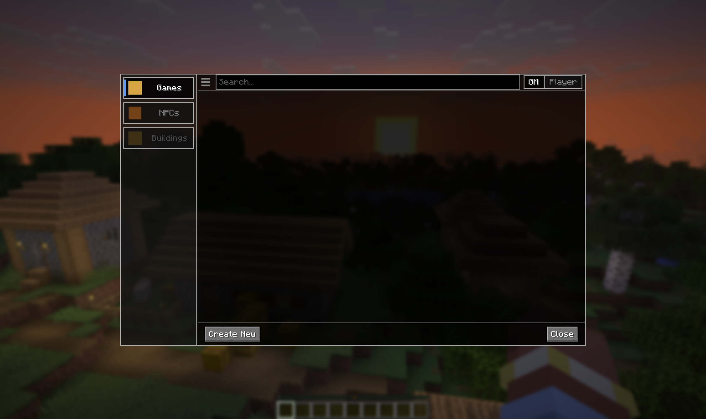
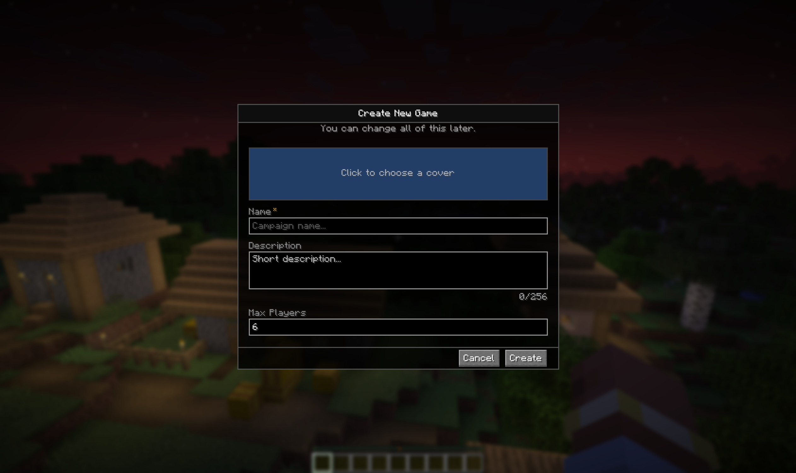
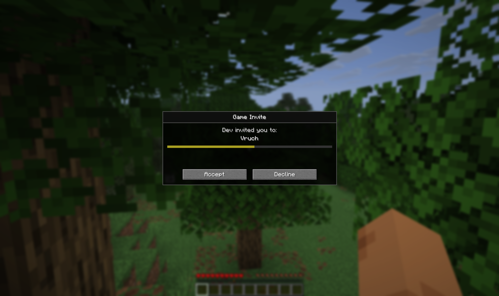
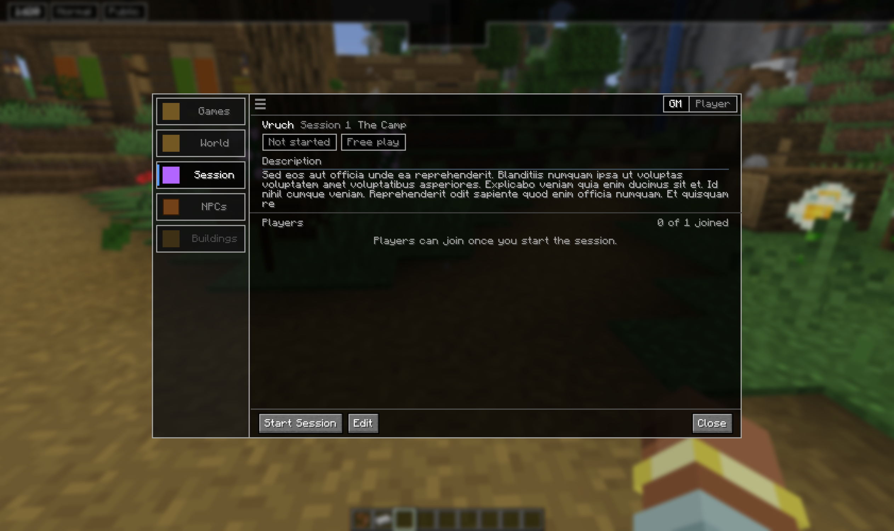
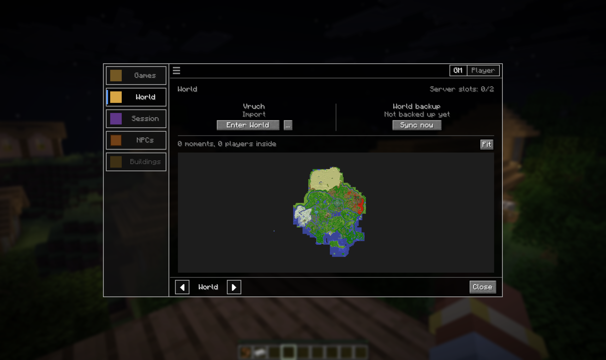
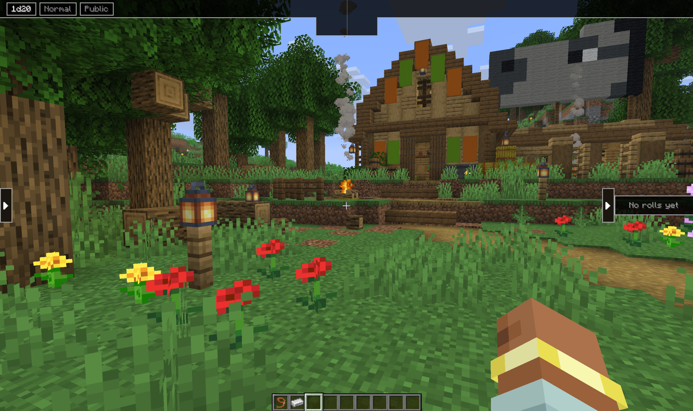
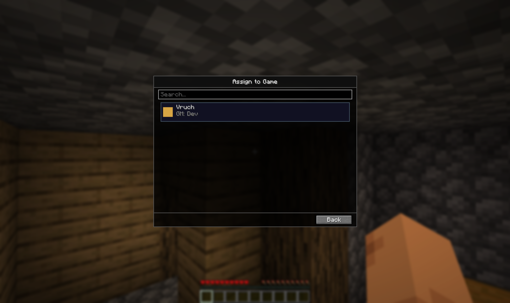
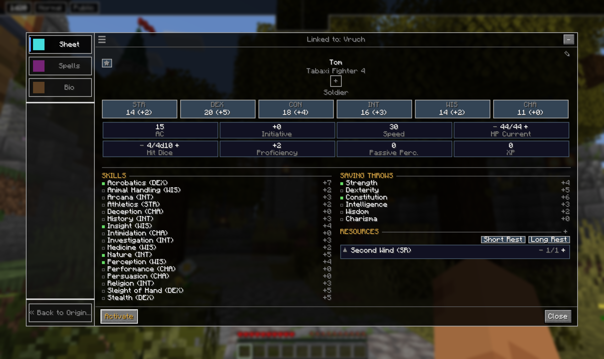

# Getting started

This walks one full session end to end: granting the GM role, creating a campaign,
getting a player in, making a world, and rolling a die. Around fifteen minutes.

## Requirements

- Minecraft 26.1
- NeoForge 26.1.2.76, or a compatible 26.1.2.x build
- Java 25

Works in singleplayer and on a dedicated server. **Every player needs the mod installed**,
not just the host. All state, dice and turn logic live on the server, and the interface and
keybinds live on the client, so both halves are required.

## Installation

Drop the VoxelRoll jar into your `mods` folder alongside a matching NeoForge install. On a
dedicated server, put the same jar in the server's `mods` folder. There is nothing to
configure, campaigns and characters are created per player once you connect.

## 1. Grant the GM role

A server operator runs:

```
/voxelroll op addgm <player>
```

The role survives restarts. `/voxelroll op removegm <player>` takes it back, and also stops
any game that player is running.

Everything below is done by whoever holds the role.

## 2. Open the panel

Press `C`. The panel opens on the Games tab with nothing in it yet.



The **GM / Player** switch in the top right changes which tabs you see. As a GM you get
Games, World, Session, NPCs and Buildings. As a player you get Games, Session, Character
and Companion.

## 3. Create a campaign

**Create New**, then give it a name and description.



The campaign is saved on your own machine, so it follows you between worlds and servers.
Open it and press **Start** to add it to the new server.

## 4. Invite a player

With the game running, invite from the Players list. The invited player gets a popup with
an expiry bar.



**Accept** puts them on your roster. Escape declines, same as **Decline**. The invite
expires on its own if they do nothing.

## 5. Start the session

A **Session** tab appears once a game is running. It shows the session name, its state, and
who has joined.



Players cannot join until you press **Start Session**. Once you have, they join from their
own Session tab, or with:

```
/voxelroll session join
```

## 6. Make a world and enter it

Go to the **World** tab and create a world for the campaign. A campaign can hold up to
three, and the arrows at the bottom page between them.



**Enter World** takes you in. Have your players enter too, by starting the session. Outside the game world, the session HUD is not visible.

Once you are in, the HUD appears: your current roll settings top left, roll history on the
right. Both collapse with the arrows.



## 7. Players and Characters

A character has to be **assigned to the game** and then
**activated** before it becomes the player's sheet.

On the player side, Character tab, **New Character**, then assign it to the joined game.
Assigning makes a copy for that game, so the original template stays untouched and can join
other campaigns later.



Open the assigned copy. Its header reads "Linked to" the campaign name, and there is an
**Activate** button in the bottom left.



Press it. From now on, opening your inventory opens this sheet instead. **Until you
activate a character, your inventory key still gives you the vanilla inventory.** But once activated, the sheet can be opened with the inventory key.

## 8. Roll something

Players roll by clicking a skill, save or attack on the sheet, or from the quick wheel by
holding `G`. As GM you can request a roll from one player or the whole table.

Every roll is made by the server and written to the shared history. Rolls you mark GM-only
never reach the players.

## Next

- [Turns and combat](../turns/) for initiative and running a fight
- [Characters and companions](../characters/) for building a sheet out
- [Worlds](../worlds/) for imports, backups and versions
- [Command reference](../commands/) for everything you can type

[Back to the manual index](../)
